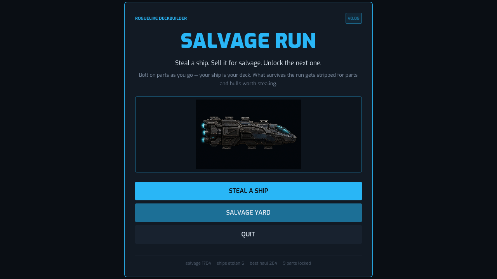
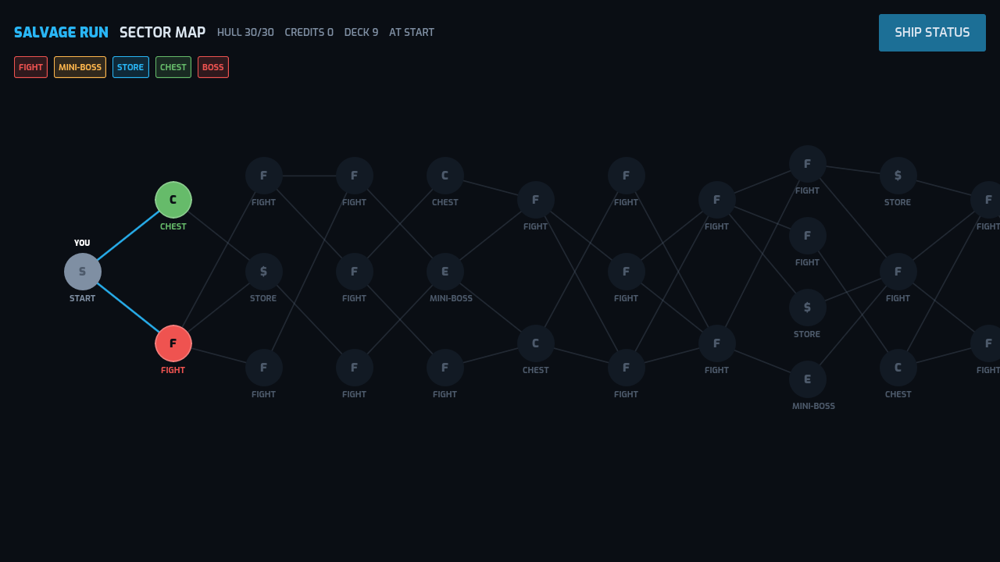
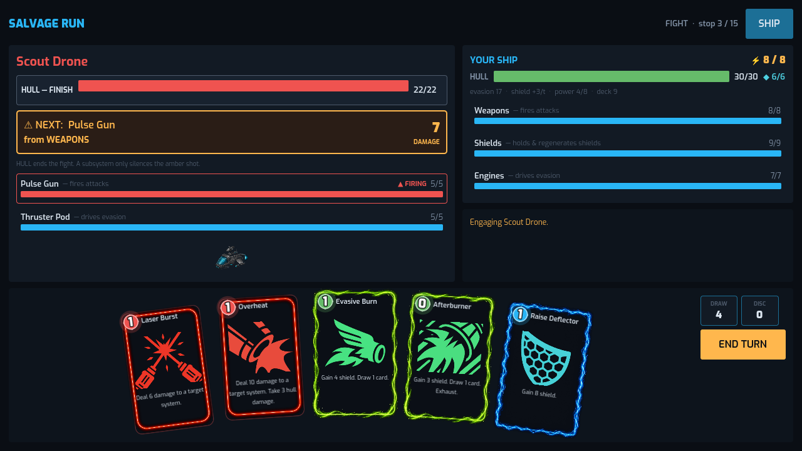
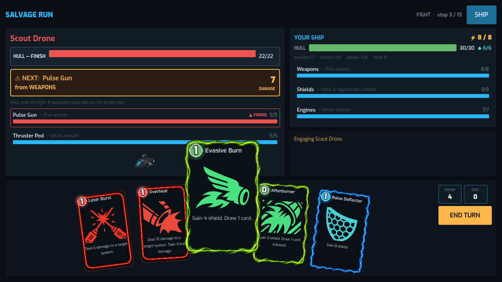
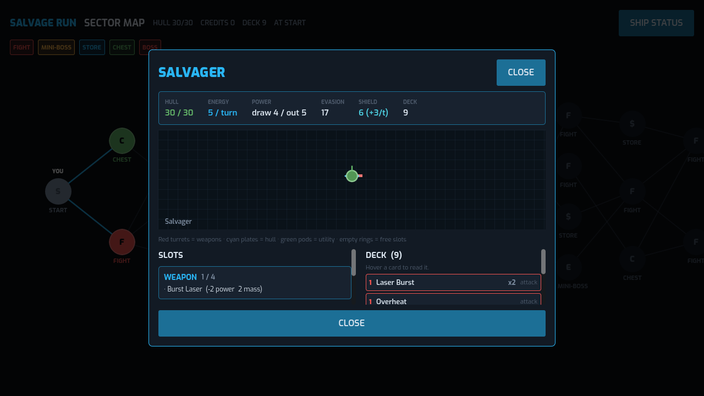
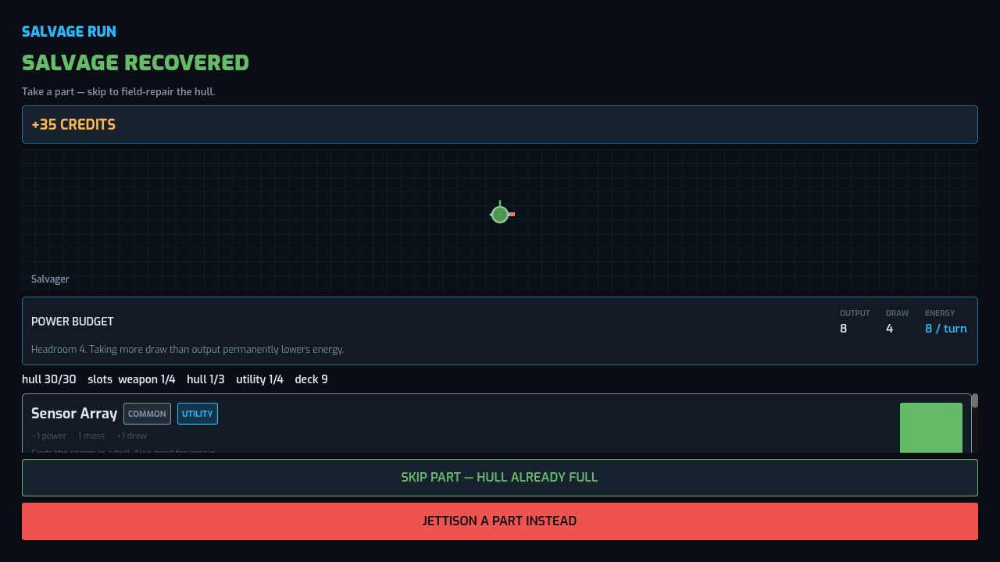
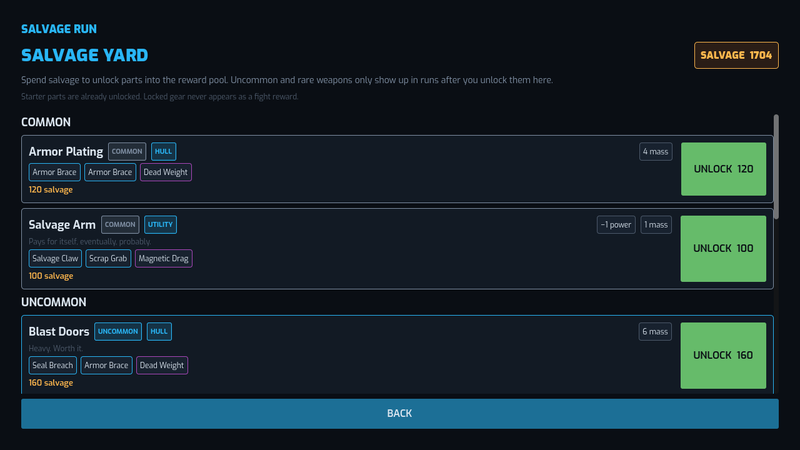
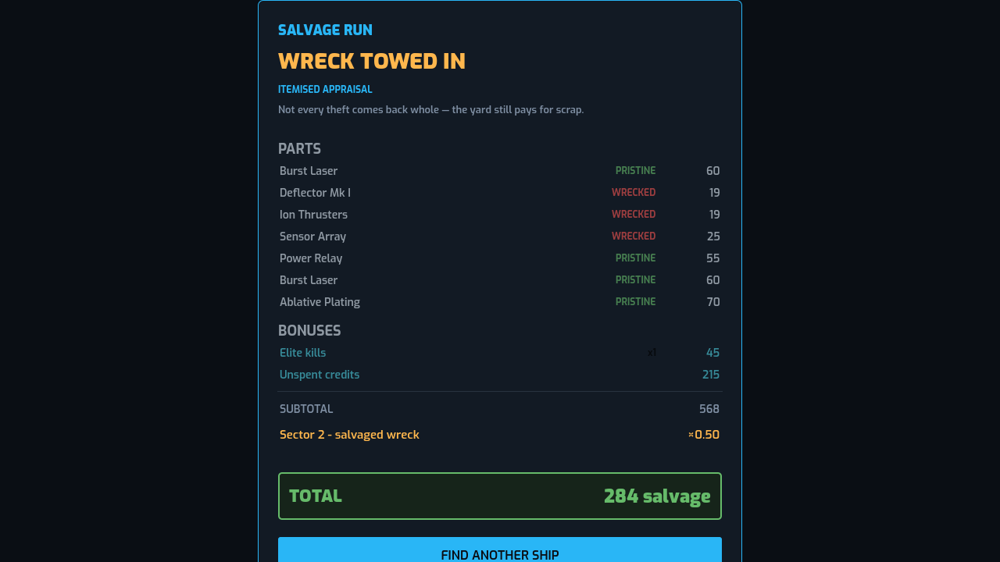

# Salvage Run

**v0.15** · by **thegliffy**

A roguelike deckbuilder where **your ship is your deck**. Steal a hull, fight
across three sectors to the final boss, then sell what you built for salvage
that unlocks new parts — and new hulls — to steal next time.

FTL's subsystem targeting, Slay the Spire's card economy and map, and a run-end
sale that turns "how good was this ship" into a number you spend.

Built with **Godot 4.7.2** / GDScript. Targets **Steam** (Windows/Linux) and
**Android**.

```
360 tests passing · playable PC demo
```

---

## Screenshots

















---

## Play it

**Windows:** download `SalvageRun-v0.15-win64.zip` from
[Releases](https://github.com/thegliffy/salvage-run/releases), unzip, run
`SalvageRun.exe`. Single self-contained executable — no installer, no separate
data files.

**From source:**

```bash
godot --path .
```

Or the exported Linux build:

```bash
./build/salvage-run.x86_64
```

> **Note on art.** Redistributable card icons (`assets/icons/`, Game-icons
> tinted by kind), painted enemy portraits (`assets/portraits/`), and module
> icons (`assets/modules/`, filenames = part ids) ship with the repo. Optional
> commercially licensed packs must not be redistributed — see
> [docs/ASSETS.md](docs/ASSETS.md). Missing files fall back rather than
> erroring (`UITheme.art()`).

**How to play.** Click a card. Hull-targeting attacks want the enemy **HULL**
bar; system cards want a subsystem. Soft systems are optional control —
knocking weapons offline silences that shot for a turn, then they auto-repair if
left alone. You can always just shoot the hull.

The amber banner is the enemy's next attack and names the subsystem that fires
it. Cards that need no target play on a single click.

**SHIP** (combat) / **SHIP STATUS** (map) opens the full loadout: slots, power
budget, deck, and the painted ship view.

## Status: playable PC demo

Title → salvage unlock shop → sector map (×3) → combat / shop / chest → rewards →
… → sector boss → next sector → … → final boss → ship sale, end to end.

**Working:** three StS-style sectors (~10 stops + boss each), combat with hull as
the primary target and soft subsystem control, typed-slot ship loadout,
power-budget UI, tiered rewards (skip = field repair), ship status overlay, ship
improvements, jettison, card stripping, run-end appraisal, meta unlock shop
(parts + hulls), overshield, Brawler / Tank / Shepherd starters, meta saves.

**Not built yet:** audio, run save/resume (Android launch blocker), Steam
integration. See [docs/ROADMAP.md](docs/ROADMAP.md).

### What's new in v0.15

- **Brawler** starter (4 weapons, 5 energy, no innate shields) and unlockable
  **Tank** (3 weapons, 4 energy, Deflector Mk I at 10 shield / +2 regen)
- Tank is the cheapest hull unlock at **450 salvage** — more than any part
- **Overshield** — shield gains above capacity stick until your next turn
- Tank-oriented weapons: Plasma Cycler, Aegis Rail, and rare **Capacitor Cannon**
  with **Shield Dump** (spend all your shield as pierce damage)
- Ship status overlay from combat and map; reward offers as equal tiles across

---

## The core idea

You never edit your deck directly. You edit your **ship**.

The hull has typed slots — **4 weapon, 3 hull, 4 utility** (Tank starts with 3
weapon slots). Each installed part grants three cards. Bolt on a Missile Rack
and `Breach Missile` enters your deck; jettison that part and its cards leave
with it. Deckbuilding and ship building are the same action.

Nothing limits how much you carry except the slots. What limits *what* you carry
is three soft costs:

| Cost | Effect |
|---|---|
| Power | draw beyond the hull's output cuts your energy every turn |
| Mass | heavier ships dodge worse |
| Deck | every part adds three cards, so a big ship draws badly |

The hull generates the power — no module does — so energy is a property of the
ship rather than a mandatory part every build has to carry. Overdraw shows as a
**power deficit** on the ship status panel and on reward offers.

### Why soft subsystem targeting matters

Enemies telegraph an intent one turn ahead, and every intent names the subsystem
it fires from:

```
Raider — Autocannon: 9 damage   [requires: weapons]
```

Knock that subsystem offline and **the shot cannot fire this turn**. Damage it
partially and the shot lands weaker. Soft systems (low HP, auto-repair if
undamaged) are temporary control — not a mandatory first gate. Hull is always a
legal finish target.

Destroyed subsystems stay targetable — shots at the wreckage spill into the hull
— so a fully disabled ship can still be finished off.

### The sector map

Three sectors. Each is start on the left, boss on the right, **10 stop layers**
between. Beat a sector boss to enter the next map; the sector-3 boss is the
finale. Node mix is roughly **70% combat / 10% shop / 10% elite / 10% chest**.
You only enter nodes linked from your current position — same reachability
rules as Slay the Spire.

### Rewards scale with the fight

| Enemy | Payout |
|---|---|
| Regular | credits + a part offer |
| Mini-boss | + a common/uncommon **ship improvement** |
| Sector boss | a **rare** part + a rare improvement |

**Improvements** fill no slot and grant no cards — they change the ship itself
(more power, more hull, another slot). Keeping them separate from parts means the
two reward types never compete for the same decision.

Skipping a part offer **field-repairs 15% of max hull**. You can also **jettison**
an installed part: the slot frees up and all three of its cards leave the deck.

### Trimming the deck

Each part can have exactly **one** of its three cards stripped, permanently, at a
store. The first strip costs **40 credits**, then 65, 90, … (`40 + 25 ×` mounts
already stripped this run). Stripping also cuts that part's **sale value** by
25%. Because the cap is one per part, a ship can never fall below two thirds of
its cards.

### Meta unlocks

Between runs, the title screen's **Salvage Yard** spends salvage to unlock parts
into the reward pool and new starter hulls. Unlocks do not hand you the part —
they make it eligible to appear on the next theft. The **Brawler** starts free;
the **Tank** is the first hull unlock (450 salvage, above any part). Starter
weapons begin unlocked (Burst Laser); uncommon/rare weapons cost salvage
(Missile Rack 150, EMP Projector 200, Carrion Lance 400, …).

### The sale

At the end of a run the ship is appraised part by part, and the itemised receipt
is the point:

```
--- SHIP SALE ---
  Burst Laser (worn)                     44
  Deflector Mk I (pristine)              55
  Hull integrity (72%)                   43
  Elite kills x2                         90
  subtotal                              282
  Sector 3 of 3 + boss                x2.63
  TOTAL                                 651 salvage
```

Wear cuts value, depth multiplies it, dying keeps 40%. The player should read the
receipt and immediately know what to do differently.

---

## Development

Run the test suite:

```bash
godot --headless --path . res://tests/headless.tscn -- --test
```

Run the balance simulator — 200 full runs in a few seconds, with a card-play
histogram that names content nobody reaches for:

```bash
godot --headless --path . res://tests/headless.tscn -- --sim 200
```

Add `--seed 42` to pin it; the same seed replays identically and narrates one
fight turn by turn.

Capture screenshots of every screen without stealing your desktop:

```bash
xvfb-run -a godot --path . -- --shots /tmp/shots
```

## Layout

| Path | What lives there |
|---|---|
| `content/*.json` | All balance data — cards, parts, enemies, improvements |
| `src/core/` | Autoloads: event bus, seeded RNG, content DB, saves, run router |
| `src/data/` | Typed definitions parsed from JSON |
| `src/ship/` | Slot loadout, parts, and `compile()` → combat profile |
| `src/combat/` | Turn loop, effect resolver, enemy AI, deck |
| `src/run/` | Run state, map generation, rewards, salvage yard |
| `src/meta/` | Persistent unlocks and the ship valuation |
| `src/ui/` | Screens, built programmatically against the event bus |
| `assets/ships/` | Painted hull art used by `ShipView` |
| `assets/icons/` | Redistributable tinted card icons (`cards.json` `icon`) |
| `assets/portraits/` | Redistributable enemy portraits (`enemies.json` `portrait`) |
| `assets/modules/` | Part / module icons (`parts.json` `icon`, default `<part_id>.png`) |
| `docs/ui-shots/` | README screenshots |
| `tests/` | Headless test suite and balance simulator |

## Docs

- [docs/DESIGN.md](docs/DESIGN.md) — why the systems are shaped this way, and what is still undecided
- [docs/ROADMAP.md](docs/ROADMAP.md) — what exists and what to build next
- [docs/SHIPPING.md](docs/SHIPPING.md) — Steam and Android specifics, toolchain setup
- [docs/DEVLOG.md](docs/DEVLOG.md) — how it was built and what broke on the way
- [docs/ASSETS.md](docs/ASSETS.md) — third-party asset provenance and licensing
- [CREDITS.md](CREDITS.md) — who made what
